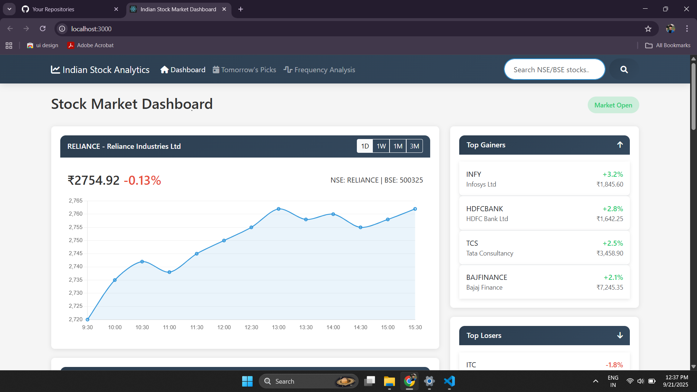

# 📊 Stock Analysis Dashboard

A powerful and interactive **Stock Market Analysis Dashboard** built with **React.js**.
Visualize candlestick charts, track stock options, manage your watchlist, and analyze stock patterns with ease. 🚀

<p align="left">
  <a href="https://react.dev/"></a>
  <a href="https://www.chartjs.org/"></a>
  <a href="#"></a>
  <a href="#"></a>
</p>

---

## ✨ Features

* 📈 **Candlestick Chart** visualization for stocks
* 📊 **Option Analysis** with trend detection
* 📌 **Stock Cards** for quick overview
* 👀 **Watchlist Management** (local storage support)
* 📡 Custom **React Hook (`useStockData`)** for fetching stock data
* ⚡ **Pattern Detection & Indicators** utilities
* 📱 **Responsive UI** with a modern design

---

## 🛠️ Tech Stack

* **React.js (18+)** – Frontend framework
* **Chart.js / React-ChartJS-2** – For stock charting
* **Custom Hooks** – Data fetching & state management
* **LocalStorage** – Save and persist watchlist
* **CSS (custom + Bootstrap/Tailwind optional)** – Styling

---

## 📂 Project Structure

```
stock-analysis/
│── build/                      # Production build
│── node_modules/               # Dependencies
│── public/                     # Static assets
│── src/
│   ├── components/             # Reusable components
│   │   ├── CandlestickChart.jsx
│   │   ├── Dashboard.jsx
│   │   ├── Header.jsx
│   │   ├── OptionAnalysis.jsx
│   │   ├── StockCards.jsx
│   │   └── Watchlist.jsx
│   ├── hooks/
│   │   └── useStockData.js     # Custom React hook
│   ├── utils/                  # Helper functions
│   │   ├── indicator.js
│   │   ├── localStorage.js
│   │   └── patternDetection.js
│   ├── App.css
│   ├── App.js
│   ├── App.test.js
│   ├── index.css
│   ├── index.js
│   ├── logo.svg
│   ├── reportWebVitals.js
│   └── setupTests.js
│── .gitignore
│── package.json
│── README.md
```

---

## 🚀 Getting Started

### 1) Clone

```bash
git clone https://github.com/Bala9840/stock-analysis.git
cd stock-analysis
```

### 2) Install Dependencies

```bash
npm install
```

### 3) Run Development Server

```bash
npm start
```

Open **[http://localhost:3000](http://localhost:3000)** in your browser.

### 4) Build for Production

```bash
npm run build
```

Outputs to `/build` folder.

---

## 🧭 How It Works (Quick Overview)

* `CandlestickChart.jsx` → Renders stock candlestick chart
* `OptionAnalysis.jsx` → Shows stock options and predictions
* `StockCards.jsx` → Displays quick stock metrics
* `Watchlist.jsx` → Manages saved stocks (localStorage)
* `useStockData.js` → Fetches & formats stock data
* `patternDetection.js` → Identifies stock patterns
* `indicator.js` → Technical indicators (e.g., RSI, moving averages)

---

## 🖼️ Output Screenshot

<div align="center">
  
</div>


---

## 📌 Future Improvements

* 🔗 Integrate **live stock APIs** (e.g., Yahoo Finance, Alpha Vantage)
* 📱 Add **dark mode**
* 📉 More technical indicators (MACD, Bollinger Bands)
* 📝 Export analysis as **PDF/CSV**
* 👥 Multi-user authentication with Firebase/Auth0

---

## 🤝 Contributing

Contributions are welcome!

1. 🍴 Fork this repo
2. 🌿 Create a branch: `git checkout -b feature/awesome-change`
3. 💻 Make your changes
4. 📤 Push to your fork
5. 🔄 Submit a Pull Request

---

## 📄 License

This project is licensed under the **MIT License**.
See `LICENSE` for details.

---

## 👤 Author

Built with ❤️ by **[Bala9840](https://github.com/Bala9840)**

---

